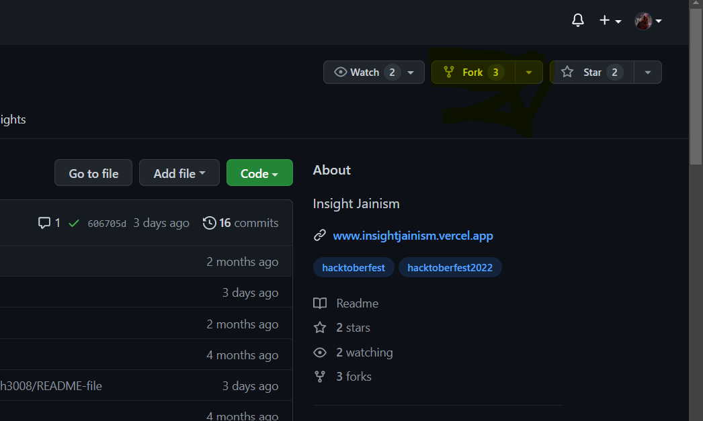
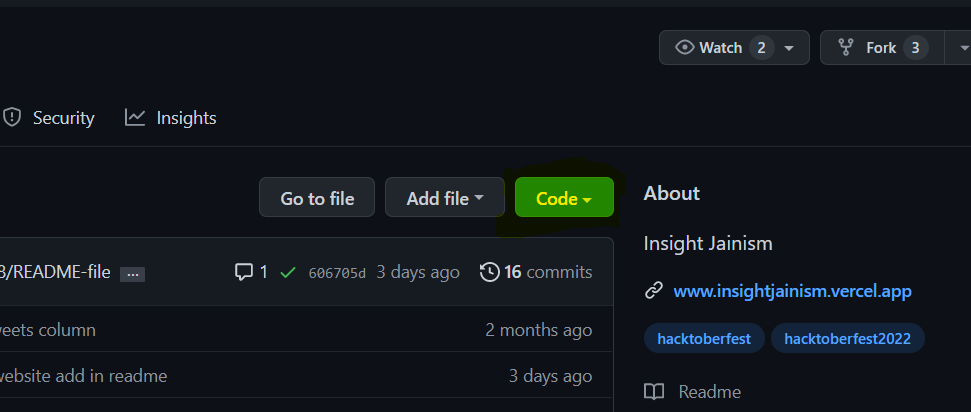
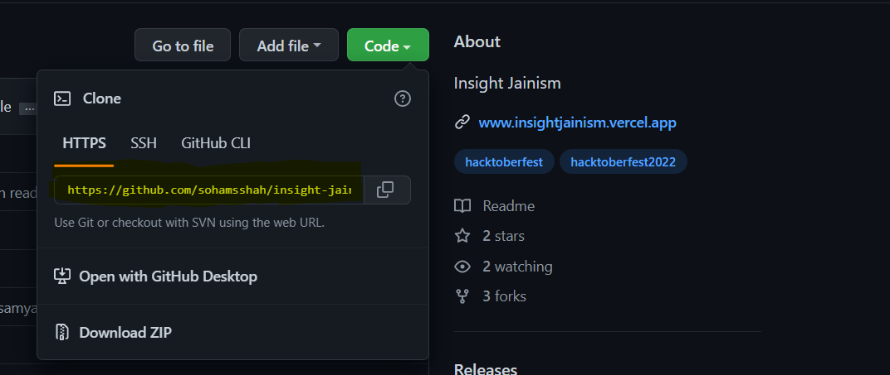
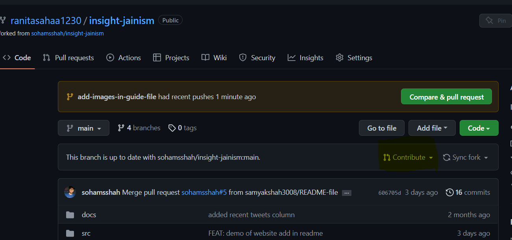

# Git Setup Guide

## To initialise Git, write

```bash
git init
```

## 1. Configure your local Git

```bash
git config --global user.name "github username"
```

```bash
git config --global user.email "email address"
```

## 2. Go to the insight-jainism repository and Fork it.

- A fork is a rough copy of a repository. Forking a repository allows you to freely test and debug with changes without affecting the original project. One of the excessive use of forking is to propose changes for bug fixing.

    

- Click on Code Button and copy the URL of your forked Repository

    

  

## 3. Switch to your Git bash window, and enter the following :

- Clone the Forked project on your local system

```bash
git clone https://github.com/sohamsshah/insight-jainism.git
```

- Make the changes(if you want to)

```bash
cd insight-jainism/
```

## 4. Creating a Pull request

### Create a branch

- A branch is designed to encapsulate a group of changes. These changes might be thrown away, entirely rewritten or in the majority of cases they’ll be promoted into the main history of the codebase - via a merge.

- Creating a branch

```bash
git branch branch_name
```

- Checkout to the created branch

```bash
git checkout branch_name
```

- Now add the files using the git command

```bash
git add .
```

- Commit the changes to the local project

```bash
git commit -m "Added my data"
```

- Push the changes to your forked github repo

```bash
git push origin branch_name
```

## 5. Final Steps

- Open your forked git repository, you will get a message like as shown in the figure, if not then refresh the page.

- Click on "Contribute"

    

- Now click on "Open pull request"

- Click on "Create pull request"

- You may add a Comment to your Pull Request

- After merging it with the main branch, you can see the changes
